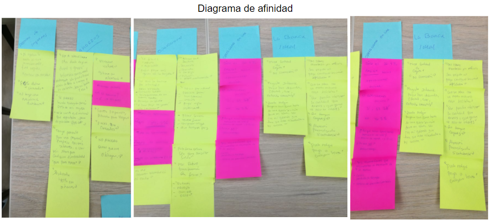
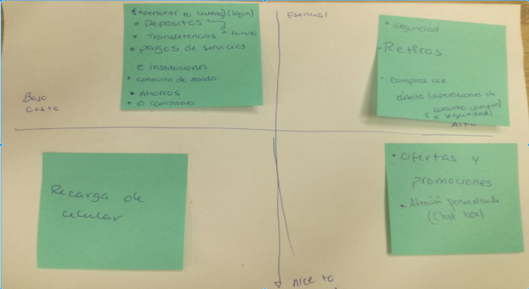

# BANCO DIGITAL PARA MILLENNIALS Y Z´S

* **TRACK:** _ESPECIALIZACIÓN UX-DESIGN_
* **CURSO:** _CONOCIENDO LOS NEGOCIOS_
* **UNIDAD 1:** _LECCIONES BÁSICAS DE NEGOCIOS_
* **UNIDAD 2:** _LECCIONES SOBRE DISEÑO Y TECNOLOGÍA_

***
## Equipo de trabajo

+ Ortiz Villafuerte, María Cristina.
+ Herrera Polo, Romina Valeria.

***
## Objetivo
Desarrollar un banco 100% digital ágil, sencillo y seguro, en alianza con el banco del país, para los millennials y generación Z a partir de 18 años.

***

## Entregables versión 1 : Unidad 1
- Identificar quiénes son los stakeholders de tu proyecto
- Planear una reunión de kick off meeting detallando:
    - 	Quiénes deberían estar presentes
    - Qué les preguntarías a los presentes
- Entregar Business Model Canvas (hipotético) del producto "Banco 100% digital" en el kick off meeting.
- Entregar un research plan.

### KICK OFF MEETING
### I Objetivos comerciales de la investigación

 **Objetivo principal**

 Desarrollar un banco 100% digital ágil, sencillo y seguro, en alianza con el banco del país, para los millennials y generación Z a partir de 18 años.

 **Objetivo Específicos**

 - Obtener la aprobación de proyecto
 - Obtener autorización del SBS como banca virtual
 - Incentivar al proceso de transformación digital en el banco del país
 - Establecer alianzas con otros bancos
 - Conocer las necesidades reales de los millennials y Z’s respectos a sus finanzas personales
 - Definir el problema(s) de a los millennials y Z´s respecto a la banca actual.

### II Producto(s)

 - Una aplicación (app) donde se pueda realizar las operaciones bancarias tradicionales de manera ágil, sencilla y segura.
 - Una página web informativa que tenga toda la información sobre el producto y su uso.

### III Usuarios o público objetivo

  Millennials y generación Z a partir de 18 años.

### IV Alcances y Limitaciones

 **Alcances**

    - El proyecto considera solo millennials y generación Z a partir de 18 años.
    - El proyecto considera solo personas que residan en Perú.

  **Limitaciones**

    - Depender de la aprobación de los accionistas para arrancar el proyecto
    - Tiempo para conseguir y convencer a los inversionistas
    - Tiempo de aprobación de la SBS como banca virtual prestadora de servicios financieros
    - Muchas zonas rurales o países en vía de desarrollo no cuentan con internet por lo que no podrían acceder a las herramientas de la banca online.
    - Para la banca electrónica online se necesita alta seguridad frente a los hackers.

### V Identificación y Análisis de Riesgos

  [Identificación y análisis de riesgos. Ver punto VI]( https://docs.google.com/document/d/1Bx5KgyJyh1_g8whCYewptTndEMN9ypiBI-OK8CxlH8o/edit#).

### VI Stakeholders

#### **Stakeholders y roles**

[Stakeholders y roles]( https://docs.google.com/document/d/1P36IaUvRrr9rEi0UmTbha8Mc_uhNrwZVgh2-zKroSU4/edit)

#### **Stakeholders presentes**

**CEO (Chief Executive Officer):**
- ¿Qué tan factible sería realizar el proyecto, considerando aspectos de inversión y de producción?
- ¿Existe algún supuesto, premisa, restricción o exclusión que tengas que tener en cuenta?

**Gerente de Riesgos:**
- ¿La inversión sería mayor a la ganancia?
- ¿Cuáles son los principales riesgos asociados al proyecto?
- ¿Hay futuro para el proyecto?

**Gerente de Marketing (CMTO):**
- ¿Qué estrategias de marketing usaríamos para hacer rentable el producto?
- ¿Cómo conseguiríamos clientes externos?
- ¿Cuál es el alcance del proyecto y sus entregables principales?.
- ¿Qué beneficios, cuál es el valor que aportará a la organización?

**Director de operaciones digitales(CDO):**
- ¿Cuánto costaría realizar el proyecto?
- ¿De dónde se sacaría la data?
- ¿Qué recursos podríamos usar para conseguirla (API’s)?

**Product Manager de banca digital:**
- ¿Cuánto tiempo tomará realizar el proyecto?

**CPO (Chief People Officer):**
- ¿Cuáles son las fechas críticas (hitos) del proyecto?
- ¿Cuántos profesionales disponibles tenemos para este proyecto?

**CXO (Chief Customer Experience Officer):**
- ¿Qué ideas extra aportaría al proyecto?
- ¿Cuál sería la propuesta para empezar de la mejor manera en el mercado?
- ¿Cuál es la mejor forma de mapear la experiencia del cliente en todos los puntos de contacto?

**Un representante de UX design:**
- ¿Cuánto tiempo tomaría hacer el research?
- ¿Cómo plasmarían la solución de los problemas a través del flujo del app?
- ¿Cómo harían el app lo suficientemente útil y usable?¿Qué tan amigable podría hacerse el app para los millenials y z’s?

**Asesor legal:**
- ¿Qué restricciones legales tenemos para desarrollar el proyecto?.

### VII Presentación del modelo de negocio (Business Model Canvas)

Puedes verlo con detalle aquí: https://canvanizer.com/canvas/w0exRhhSBSmXI

### VIII Presentación del plan de investigación

Puedes verlo con detalle aquí: https://www.preceden.com/timelines/360333-macri

https://docs.google.com/document/d/1sUv8kcMbOo4XrlCj9gU17_05368TvdFVIzppmbtteEU/edit?usp=sharing

### IX Distribución y firma del acta

- Se dejará en  claro los compromisos y las tareas asumidas por todas las partes así como los responsables de su ejecución.
- Será firmada por todos los asistentes.

***

## Entregables versión 2: unidad 2
- Llevar a cabo las actividades de investigación.
- Crear un prototipo de la nueva banca digital - basado en el journey más crítico que encuentres en tu investigación
- Hacer sesiones de testing
Iterar y concluir

### I. Descubrimiento e Investigación

**Entrevistas personales**
-	Se entrevistaron a 4 usuarios millennials de un rango de edad de 22-25 años el día 06-03-18.La entrevista duró como máximo 30 minutos.

-	El uso de esta herramienta nos permitió conocer más a profundidad la relación con el banco al cual están afiliados: Frecuencia de visitas al banco, sobre su tipo de cuenta y las operaciones que realiza tanto online como en físico; así como también sobre sus finanzas personales: Ahorros y organización de sus ingresos monetarios.

-	Organización de la información de las entrevistas personales: https://docs.google.com/spreadsheets/d/1YNVG8GX4eBYMqaj4fRGDG581XLpwtDOHxDFh6HlDLqY/edit#gid=0

-	Entrevistas personales (audio y video):
   - https://drive.google.com/drive/folders/157c3Wc6saYQ02POb8dJWRtWDx9eXGEDo
   - https://drive.google.com/drive/folders/157c3Wc6saYQ02POb8dJWRtWDx9eXGEDo
   - https://drive.google.com/drive/folders/157c3Wc6saYQ02POb8dJWRtWDx9eXGEDo

**Encuesta Online**

-	Se hizo una encuesta online a los millennials de un rango de edad de 18-36 años el día 06-03-18.

-	El uso de esta herramienta nos permitió conocer a escalas generales (%) sobre la relación de los millennials con los bancos a los cuales estan afiliados.

- Encuesta: https://docs.google.com/forms/d/e/1FAIpQLScVTbB8eTWuoJIUPafRbaQlRlru-VDkFoJJ19xXEkf5Uy8OGg/viewform?usp=sf_link

### II. Síntesis y definición

**Diagrama de Afinidad**

-	Se hizo un diagrama de afinidad tomando la información de las entrevistas personales y encuesta.

-	El uso de esta herramienta nos permitió resumir, sintetizar la información de research para obtener:
     - Cuales son las operaciones bancarias que más realizan los millennials.
     - Problemas puntuales en los ahorros y distribución de sus ingresos monetarios.

**Priorización de feature list**

-	Se priorizó los feature list definidos a partir del diagrama de afinidad mediante un cuadro de cuatro entradas.

-	El uso de esta herramienta nos permitió priorizar las operaciones o funcionalidades factibles de realizar deacuerdo a la **importancia** y al **costo**, se realizarón las funcionalidades esenciales y de bajo costo (I cuadrante).

- Operaciones o funcionalidades:
    - Registro.
    - Trasferencias.
    - Pago de servicios.
    - Retiros.
    - Billetera (Organiza tus ingreso)
    - Alcancia (Crea metas de ahorros)

### III. Ideación

**Card Soarting**

-	Se hizo un card soarting para definir los componentes de cada funcionalidad (feature list).

-	El uso de esta herramienta nos permitió definir que componentes tendrán cada operación o funcionalidad. Se hizo un card soarting de tipo cerrado.

### IV. Prototipado

**Prototipo de baja fidelidad: Paper prototipyng**

Para poder ir materializando el card soarting realizado, empezamos con un prototipo de baja fidelidad en el cual empezamos a hacer el flujo de nuestra aplicación e ir testeando. En las siguientes imagenes se pueden ver nuestro protoptipo

### V. Testing

-	Se testeó con 3 usuarios millennials y Z’s de un rango de edad de 19-25 años (08-03-18). El testeo duró como máximo 40 minutos.

-	La aplicación de esta herramienta nos permitió entender si la propuesta de aplicación de un banco digital para millennials era fácil de entender sin hacerle perder tiempo al usuario en concentrarse y adivinar como funciona, recoger los feedback y mejorar la aplicación.

- Organización de la información del testing: https://docs.google.com/spreadsheets/d/18WWWoocawIAjpPkmUwgwSEwtZCoW4ErS82TZ5sIOzvM/edit#gid=0

**Usuario 1 (19 años)**
-	No entendía que tenía que hacer click en la parte de “preguntas frecuentes”.
- Billetera: Dinero que tiene en su cuenta, no como una ópción para organizar los ingresos.
- No entendía las barras de en Alcancía y billetera, eran muy pequeñas.
- No sabía como ver los detalles de cada meta en la opción alcancía.

**Usuario 2 (25 años)**
- En pagos de servicios no visualiza la ópcion de colocoar N° de suministro o referencia.
- No sabía como ubicar el detalle ni agregar un "extra a tu meta" de cada meta en la opción alcancía.

**Usuario 2 (27 años)**
-	No entendía que tenía que hacer click en la parte de “preguntas frecuentes”.
- En los pagos a servicios: Los servicios fijos agua, luz, tv, etc. Podrían ir iconos de las empresas fijas en vez de una lista, se le hacía más cómodo.
- Billetera: Nosa bía que era una opción para organizar sus ingreso, entendió como la plata que tiene guardada.
- "agregar una meta" en opción alcancía lo entendió como un título no más como una opción.

### VI. Prototipado

**Prototipo de alta fidelidad: Figma, Marvel**

Después de testear nuestro prototipo de baja fidelidad y tener un flujo listo, hicimos nuestro prototipo de alta fidelidad en figma y marvel, para asi poder darle interacción. En el siguiente enlace se puede apreciar:
https://marvelapp.com/project/2784637/

### VII Conclusiones

- Los Millennials son personas que necesitan respuestas digitales a sus problemas bancarios para ahorrar tiempo y dinero, para esto es necesario dar seguridad a estas aplicaciones.
- Los Millennials desean ahorrar, pero no encuentran el método de como hacerlo. El ofrecerles una aplicación que los ayude a lograrlo para así ir alcanzando metas es necesario para ellos.
- La mayoría se anima por bancos que cobran bajos montos por las transacciones.
- Las operaciones bancarias más realizadas son pagos de servicios e instituciones y transferencias.

### VIII Feedback en la presentación de la propuesta de la aplicación: Future Bank (09-03-18)

 Presentación de la propuesta: Future Bank: https://docs.google.com/presentation/d/140gjTcQ5INy0pZ2Qmx6qJvImixjwxYdC2sSkgr8OO7o/edit#slide=id.p

-	Problema en el contraste: color de fondo con el color de las palabras.
-	Los colores no son muy adecuados para millennials, se relaciona más con un banco tradicional.

-	El flujo y las propuestas de valor se muestran interesantes.
